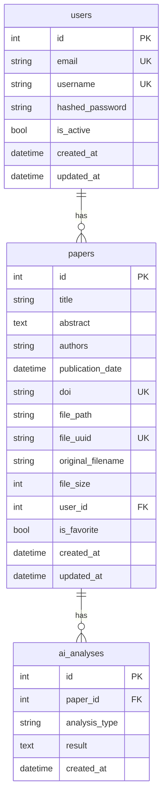

# Database Design Review

审核 `backend/app/models/` 和 `backend/app/utils/database.py` 的数据库层设计与使用。

## 项目数据库架构

```
数据库: SQLite (sqlite:///./paperpilot.db)
ORM:    SQLAlchemy 2.0 + declarative
迁移:   Alembic
```

### 表结构



## 检查项

### 1. 模型定义规范

- 所有模型继承 `Base`（`from app.utils.database import Base`）
- `__tablename__` 使用蛇形复数：`users`、`papers`、`ai_analyses`
- 主键统一 `Column(Integer, primary_key=True, index=True)`
- 外键统一 `Column(Integer, ForeignKey("表名.id"), nullable=False)`
- 字符串列指定长度：`Column(String(255))`、`Column(String(36))`
- `DateTime` 列使用 `server_default=func.now()` + `onupdate=func.now()`
- `__repr__` 方法返回可读性好的字符串表示

### 2. 关系定义

- 双向关系：`relationship()` + `back_populates`（非 `backref`）
- 父表定义关系，子表定义外键
- 级联删除：子表关系应设置 `cascade="all, delete-orphan"`
- 关系命名：
  - 一对多：父用复数（`user.papers`），子用单数（`paper.user`）
  - 多对一：单数形式（`ai_analysis.paper`）

| 关系 | 父 → 子 | 子 → 父 | 级联 |
|------|---------|---------|------|
| User ↔ Paper | `papers = relationship("Paper", back_populates="user")` | `user = relationship("User", back_populates="papers")` | ❌ 不级联（User 删除前需手动清理） |
| Paper ↔ AIAnalysis | `ai_analyses = relationship("AIAnalysis", back_populates="paper", cascade="all, delete-orphan")` | `paper = relationship("Paper", back_populates="ai_analyses")` | ✅ Paper 删除时自动删除关联分析 |

### 3. 统一注册

- `app/models/__init__.py` 必须导入所有模型类，确保 `Base.metadata` 完整注册
- Alembic `env.py` 中也需导入 `from app.models import User, Paper, AIAnalysis`
- 新模型必须同时在 `__init__.py` 和 `env.py` 注册

### 4. 查询规范

- 查询统一在 Service 层，不在路由层直接 `db.query()`
- 用户隔离过滤：`.filter(Paper.user_id == user_id)`
- 查询函数签名首参固定为 `db: Session`
- 分页参数：`.offset(skip).limit(limit)`
- 查询结果不存在返回 `None`（通过 `.first()`），不抛异常
- 避免 N+1 查询（使用 `joinedload` 或 `subqueryload` 按需加载关系）

### 5. 事务管理

- `add()` → `commit()` → `refresh()` 三步标准流程
- 事务在 Service 层 commit，不在路由层 commit
- 批量操作在 single commit 内完成
- 错误时 SQLAlchemy 自动 rollback（session 作用域内）

### 6. 迁移管理

- Alembic 迁移文件生成：`alembic revision --autogenerate -m "描述"`
- **仔细审查**自动生成的迁移脚本 — `--autogenerate` 可能遗漏或误判
- 迁移前检查：`alembic current`（当前版本）→ `alembic history`（历史）
- 迁移执行：`alembic upgrade head`
- 回滚：`alembic downgrade -1`
- SQLite 限制：
  - 不支持 `ALTER COLUMN`（修改列需重建表）
  - 不支持 `DROP CONSTRAINT`（需重建表）
  - 批量迁移时注意 SQLite 的锁行为

### 7. 索引策略

| 列 | 索引 | 说明 |
|----|------|------|
| `User.email` | `unique=True, index=True` | 登录查询频繁 |
| `User.username` | `unique=True, index=True` | 登录查询频繁 |
| `Paper.doi` | `unique=True, index=True` | 唯一标识符 |
| `Paper.user_id` | ❌ 缺少索引 | 每页查询都过滤 user_id，建议添加 |
| `AIAnalysis.paper_id` | ❌ 隐式（FKey） | SQLite 不自动创建 FK 索引 |

### 8. 数据库配置

```python
# SQLite 连接（开发环境）
engine = create_engine(
    "sqlite:///./paperpilot.db",
    connect_args={"check_same_thread": False}  # FastAPI 多线程需要
)

# Session 工厂
SessionLocal = sessionmaker(autocommit=False, autoflush=False, bind=engine)
```

- `check_same_thread=False` — FastAPI 多线程必须
- `autocommit=False` — 显式事务控制
- `autoflush=False` — 避免自动 flush 导致的意外

## 常见问题对照表

| 问题 | 影响 | 修复 |
|------|------|------|
| 模型未在 `__init__.py` 导入 | Alembic 不生成对应表 | 添加 `from app.models.xxx import Xxx` |
| 缺少索引 | 大数据量表查询慢 | 添加 `index=True` 或 `Index()` |
| Service 层不 commit | 数据未写入数据库 | 确保有 `db.commit()` |
| 硬编码查询在路由层 | 不可测试、不可复用 | 移到 service 层 |
| 缺少 `cascade="delete"` | 删除父资源时报外键错误 | 添加级联关系 |
| SQLite 不支持并发写 | 生产环境局限 | 生产建议迁至 PostgreSQL |

## 输出格式

```markdown
# Database Design Review Report

## 概况
- 模型数：N
- 表数：N
- 问题数：N

## 按模型

### User
| 检查项 | 结果 | 说明 | 建议 |
|--------|------|------|------|
| 索引 | ✅ | email/username 已索引 | - |
| 关系 | ✅ | back_populates 双向 | - |
| 级联 | ⚠️ | 缺少 papers 级联 | 添加 cascade 或手动清理 |
| ... | ... | ... | ... |

## 总结
- 突出问题：...
- 建议优先修复：...
```
